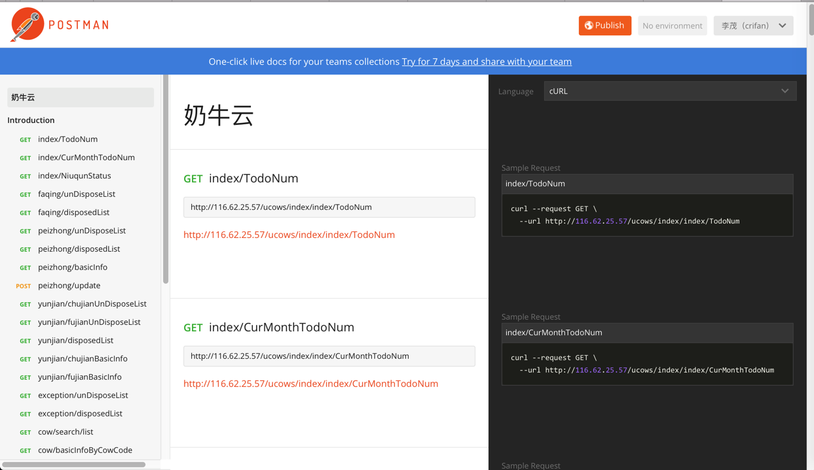

# 用Postman生成API文档
步骤：
1. Collection
2. 鼠标移动到某个Collection
3. 点击 三个点
4. Publish Docs
5. Publish
6. Public URL
7. 别人打开这个Public URL即可查看API文档

效果：

详见：
【整理】API接口调试利器：Postman

* **优点**：
  * 方便
    * 因为本身往往已用Postman调试接口，调试完毕后，即可发布
  * 及时更新文档
    * 同理，在后台代码更新后，用Postman调试无误后，即可再次点击发布即可，无须手动修改API文档
  * 美观
    * Postman生成的在线的API文档已足够清晰和美观
* **缺点**：
  * 必须依赖于在Postman中调试接口
