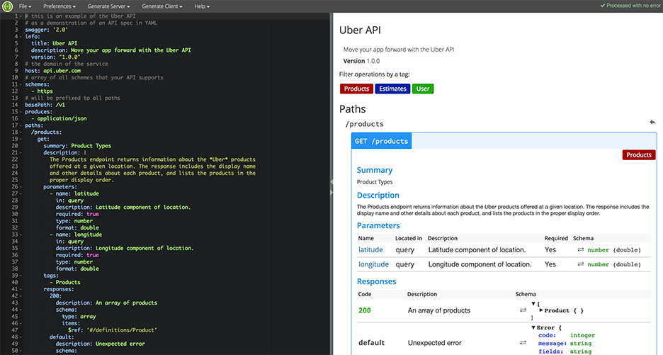

# 用Swagger写（设计API接口的同时就可以生成出）API文档

效果：
[API Development Tools | Swagger Editor | Swagger](https://swagger.io/swagger-editor/)

详见：
【整理】swagger OpenAPI

* 优点：
  * 设计API接口的同时就是编写好了API文档
    * 因为有对应的工具可以直接生成API文档
  * 另外可以同时生成服务器端和客户端的代码
    * 剩下的只需要自己编写业务逻辑即可，支持N多种编程语言
  * 美观
    * 生成的API文档层次够清晰，够美观
* 缺点：
  * 必须用swagger去设计和编写API文档

