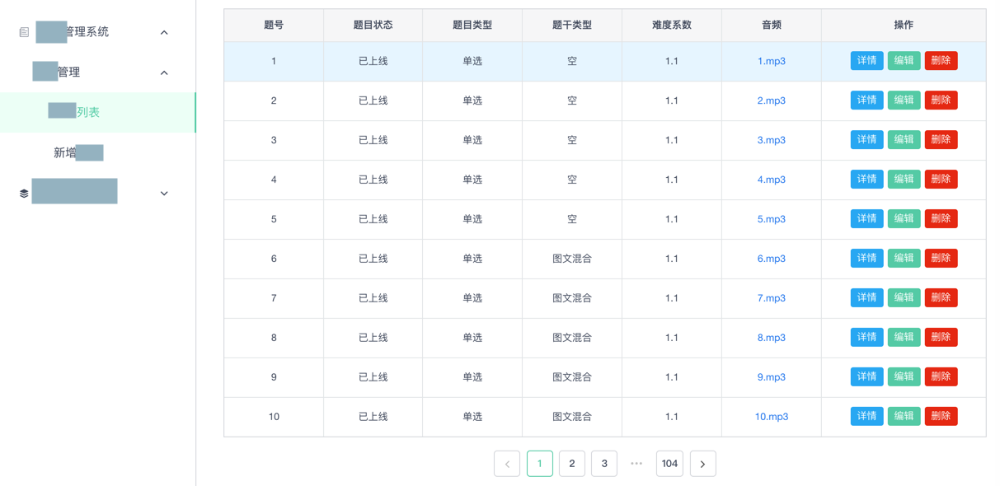

# 分页=`paging`=`pagination`

写`REST`接口时，常会遇到一种情况是：

前端（web，移动端等）页面需要分多页，列出相关数据，供查看、编辑等操作。

随便截个某个管理后台中的某个数据的列表的图，好让大家有个更直观的理解：



而后台接口不可能，也不合适，一次性返回所有数据，而合理的做法和最佳实践是：分页

英文的说法一般是：`paging`=`pagination`

即每次返回一页数据，而想要获取更多数据，或下一页数据，则继续传入不同参数值即可

## 分页请求时的参数

而设计分页的API时，前端传入的参数中，最常见的，最重要的参数，就是：

* 当前是第几页=`page`=`cur_page`=`current_page`=`curPageNum`
* 每一页的个数=`per_page`=`numPerPage`=每一页的大小=`page_size`=`pageSize`

也有另外一种说法：

* 从哪个开始的=`start`：
  * 另外一种叫法是：偏移量是多少=`offset`
* 返回的个数限制是多少=`limit`

总结一下就是：关于表示当前从哪里开始，要返回多少数据，有如下几类表示方法：

* 页数表示法：
  * `page` + `per_page`
    * `cur_page` + `per_page`
  * `page` + `page_size`
    * `page` + `pageSize`
    * `curPageNum` + `pageSize`
    * `curPageNum` + `numPerPage`
* 偏移量表示法：
  * `start` + `limit`
  * `offset` + `limit`

对应着前端页面`GET`请求所访问的典型的url是：

* `accounts?page=5&per_page=10`
* `accounts?limit=100&offset=300`
* `accounts?curPageNum=2&numPerPage=20`

## 分页返回的数据

分页返回的结果中，往往也包含了请求中所包含的基本参数，比如`当前是第几页`和`每一页的个数`。

另外肯定还要包含真正所需要的数据：

* `类型`：一般都是数组`list`
* `命名方式`：有多种方案可选择：
  * 不固定：
    * 每个不同分页接口用自己的名字：一般采用对应的数据对象的名字，比如：
      * 用复数：比如`tasks`
      * 用列表：比如`taskList`
  * 固定：
    * 用固定的字段表示返回的结果：比如`results`，`items`，

有时候，为了更加方便前端页面显示，比如希望知道：

* 总的个数有多少
* 是否还有下一页
  * 以此来控制页面上的下一页按钮是否可以点击，如果不可点击一般颜色采用灰色，否则显示正常的颜色

这种时候，往往还会加上一些其他相关的参数，比如`总页数`，`总个数`，`是否还有下一页`，`是否还有前一页`等等。

这类相关参数，加上之前的基本参数，总结起来大概有这些：

* `page`=`cur_page`=`current_page`=`curPageNum`：当前是第几页
  * 说明：一般从`0`或`1`开始
  * 或：
    * `start`：从哪个开始的
      * 说明：一般从`0`开始
      * =`offset`：（离最开始的）偏移量是多少
* `per_page`=`numPerPage`：每一页的个数
  * 说明：常见的值有`10`，`20`等等
  * =`每一页的大小`=`page_size`=`pageSize`
  * 或：`返回的个数限制是多少`=`limit`
* `has_prev`=`hasPrev`：是否还有前一页
* `has_next`=`hasNext`：是否还有后一页
* `pages`=`totalPageNum`：总的页数
* `total`=`totalNum`=`counts`：总数=总个数=符合当前分页查询条件所返回的总个数
* `items`：真正的数据的列表

> #### info:: 相关帖子
> 详见：[【已解决】Flask-Restful中如何设计分页的API](http://www.crifan.com/flask_restful_how_design_paging_api)

甚至还有些人会返回前一页和后一页的url：

* previous：前一页的url
* next：后一页的url

比如：

```bash
HTTP 200 OK
{
    "count": 1023
    "next": "https://api.example.org/accounts/?page=5",
    "previous": "https://api.example.org/accounts/?page=3",
    "results": [
       …
    ]
}

HTTP 200 OK
{
    "count": 1023
    "next": "https://api.example.org/accounts/?limit=100&offset=500",
    "previous": "https://api.example.org/accounts/?limit=100&offset=300",
    "results": [
       …
    ]
}

```

## 举例

下面给出一些实际的例子。

### 获取task任务的分页数据

下面给出之前某个`Python`的`Flask + SQLAlchemy`项目中查询一个`task`=任务的分页查询的相关代码：

```python
    curPageTaskList = None
    taskPagination = None

    if curRole == UserRole.Initiator:
        taskPagination = Task.query.filter_by(initiatorId=userId).paginate(
            page=curPageNum,
            per_page=numPerPage,
            error_out=False)
    elif curRole == UserRole.Errandor:
        taskPagination = Task.query.filter_by(errandorId=userId).paginate(
            page=curPageNum,
            per_page=numPerPage,
            error_out=False)

    paginatedTaskList = taskPagination.items

    paginatedTaskDict = {}
    for curIdx, eachTask in enumerate(paginatedTaskList):
        paginatedTaskDict[eachTask.id] = marshal(eachTask, task_fields)

    respPaginatedTaskInfoDict = {
        "curPageNum"    : taskPagination.page,
        "totalPageNum"  : taskPagination.pages,
        "numPerPage"    : taskPagination.per_page,
        "hasPrev"       : taskPagination.has_prev,
        "hasNext"       : taskPagination.has_next,
        "totalTaskNum"  : taskPagination.total,
        'tasks'         : paginatedTaskDict
    }
```

以及返回的结果：

```json
{
    "code": 200,
    "message": "get task/orders ok",
    "data": {
        "curPageNum": 2,
        "hasNext": false,
        "hasPrev": true,
        "numPerPage": 10,
        "tasks": {
            "task-10b01105-ec53-41bb-810e-720ab468bdf7": {......},
            "task-da013992-e7aa-4ae9-8b6f-bdf621b9fbaa": {......},
            "task-f3c0c660-e7f5-4583-bab2-23c7006dadc4": {......},
            "task-f7a4d0df-3142-444b-a962-83660acd447f": {......}
        },
        "totalNum": 14,
        "totalPageNum": 2
    }
}
```

相关解释：

* 分页的变量选择用：`curPageNum` + `numPerPage`
* 返回的数据的列表：名字用`tasks`，表示task任务的复数，真正返回的数据的列表

### 获取question题目的分页数据

代码：

```python
class QuestionAPI(Resource):

    def get(self):
        log.info("QuestionAPI GET")

        respDict = {
            "code": 200,
            "message": "Get question ok",
            "data": {}
        }

        parser = reqparse.RequestParser()
        # parameters for get question list
        parser.add_argument('pageNumber', type=int, default=1, help="page number for get question list")
        parser.add_argument('pageSize', type=int, default=settings.QUESTION_PAGE_SIZE,
                            help="page size for get question list")
        ...
        parser.add_argument('checkpointList', type=str, help="checkpoint for get question list")
        ...

        parsedArgs = parser.parse_args()
        log.debug("parsedArgs=%s", parsedArgs)

        if not parsedArgs:
            return genRespFailDict(BadRequest, "Fail to parse input parameters")

        ...
            # get question list
            pageNumber = parsedArgs["pageNumber"]
            pageSize = parsedArgs["pageSize"]
            if pageNumber < 1:
                return genRespFailDict(BadRequest.code, "Invalid pageNumber %d" % pageNumber)

            findParam = {}

            ...

            checkpointList = parsedArgs["checkpointList"]
            if checkpointList:
                maxFilterItemCount = 3
                filterItems = checkpointList.strip(', ').split(',')
                if len(filterItems) > maxFilterItemCount:
                    return genRespFailDict(
                        BadRequest.code,
                        '{} items found in checkpoint parameter list, of which the max count is 3'.format(
                            len(filterItems))
                    )
                checkPointFilterParam = [{'checkpoint.{}'.format(index): int(param)}
                                         for index, param in enumerate(filterItems)]
                if "$and" in findParam:
                    findParam["$and"].extend(checkPointFilterParam)
                else:
                    findParam["$and"] = checkPointFilterParam

            ...

            sortBy = "question_number"
            log.debug("findParam=%s", findParam)
            sortedQuestionsCursor = collectionEvaluationQuestion.find(findParam).sort(sortBy, pymongo.ASCENDING)
            totalCount = sortedQuestionsCursor.count()
            log.debug("search question: %s -> totalCount=%s", findParam, totalCount)
            if totalCount == 0:
                respData = {}
            else:
                # Note: for debug
                # follow will cause error: 
                # pymongo.errors.InvalidOperation cannot set options after executing query
                # foundAllQuestions = list(sortedQuestionsCursor)
                # log.debug("foundAllQuestions=%s", foundAllQuestions)

                totalPageNum = int(totalCount / pageSize)
                if (totalCount % pageSize) > 0:
                    totalPageNum += 1
                if pageNumber > totalPageNum:
                    return genRespFailDict(BadRequest.code, \
                        "Current page number %d exceed max page number %d" % \
                        (pageNumber, totalPageNum))

                skipNumber = pageSize * (pageNumber - 1)
                limitedQuestionsCursor = sortedQuestionsCursor.skip(skipNumber).limit(pageSize)
                questionList = list(limitedQuestionsCursor)
                removeObjIdList = []
                for eachQuestion in questionList:
                    eachQuestion = filterQuestionDict(eachQuestion)
                    removeObjIdList.append(eachQuestion)

                hasPrev = False
                if pageNumber > 1:
                    hasPrev = True
                hasNext = False
                if pageNumber < totalPageNum:
                    hasNext = True

                respData = {
                    "questionList": removeObjIdList,
                    "curPageNum": pageNumber,
                    "numPerPage": pageSize,
                    "totalNum": totalCount,
                    "totalPageNum": totalPageNum,
                    "hasPrev": hasPrev,
                    "hasNext": hasNext,
                }

            respDict["data"] = respData
            return jsonify(respDict)
```

请求：

`GET /question?pageNumber=1&pageSize=10&checkpointList=73,83,85`

响应：

```json
{
    "code": 200,
    "data": {
        "curPageNum": 1,
        "hasNext": false,
        "hasPrev": false,
        "numPerPage": 10,
        "questionList": [
            {
                "_id": "5c628227bfaa44aa7b2f56a5",
                "active": "Y",
                "audio": "",
                ...
            },
            {
                "_id": "5c628261bfaa44aa7b2f56aa",
                "active": "Y",
                "audio": "",
                ...
            },
            ...
        ],
        "totalNum": 3,
        "totalPageNum": 1
    },
    "message": "Get question ok"
}
```

### 获取book列表的分页数据

请求：

`GET /list.vpage?page_size=20&current_page=3`

响应，返回的json：

```json
{
    "success": true,
    "total_page": 15,
    "total": 300,
    "data": [
        {
            "id": "PBP_10300000138949",
            "name": "Cool Cat",
            ...
        },
        ...
        {
            "id": "PBP_10300000181801",
            "name": "Red Ben",
            ...
        }
    ],
    "current_page": 3,
    "page_size": 20,
    "selected_lexiler": "BR200L-300L",
    "selected_tag": ""
}
```