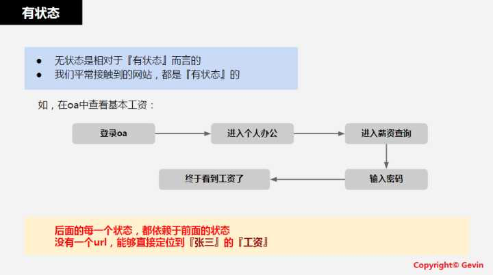

# RESTful API简介

服务器后台设计API接口时，目前最流行的风格（原则/标准/规范）就是`RESTful`，往往简称为`REST`。

其中 `REST`=`REpresentational State Transfer`

* `REST`直译：表现层状态转移
* `REST`核心含义：无状态的资源
  * 资源的变化（CURD）都是通过操作去实现的
    * 资源可以用 [URI](https://en.wikipedia.org/wiki/Uniform_resource_identifier) 表示
    * 用不同的URI和方法，表示对资源的不同操作
      * 典型的：
        * `GET`：获取资源
        * `POST`：新建资源
        * `PUT`：更新资源
        * `DELETE`：删除资源

## `REST`接口设计的特点/要求

* 接口形式统一=Uniform Interface
* 无状态=Stateless
* 可缓存=Cacheable
* 客户端服务器架构=Client-Server
* 分层设计=Layered System
* [可选]按需执行=COD(Code on Demand)
  * 解释见：[What is the code-on-demand constraint? - The RESTful cookbook](http://restcookbook.com/Basics/codeondemand/)

## RESTful的通俗理解

借用[某人](https://www.zhihu.com/question/28557115/answer/41267240)的总结：

* 看`url`就知道**要什么**
* 看`http method`就知道**干什么**
* 看`http status code`就知道**结果如何**

### 其他类型的接口设计风格\(含RESTful\)

* `ROA`=`Resource Oriented Architecture`
* `RPC`=`Remote Procedure Call`
* `SOA`=`Simple Object Access Protocol`
* `REST`=`REpresentational State Transfer`

### 关于无状态的解释

#### 有状态

#### 无状态

