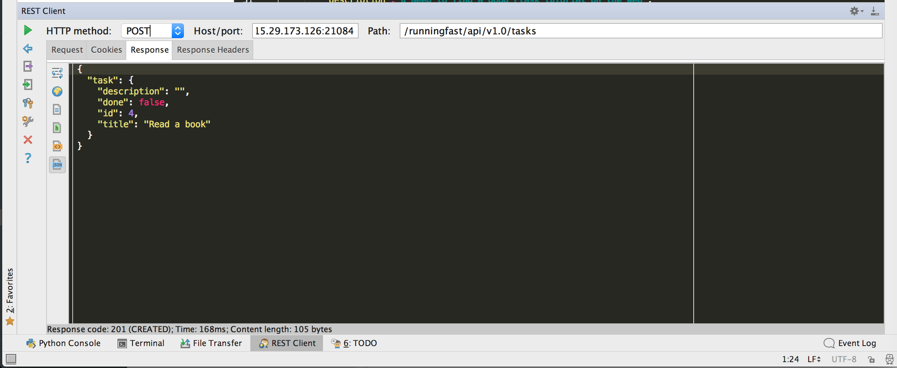

# RESTful的API测试工具

## Postman
详见另外的教程：[API开发利器：Postman](http://book.crifan.com/books/api_tool_postman/website)

## PyCharm中的Restful API测试工具

详见：【整理】flask restful api 测试工具

## Chrome插件：`Advanced REST client`
详见：[［记录］chrome的websocket插件：Advanced REST client](https://www.crifan.com/chrome_websocket_plugin_advanced_rest_client/)

